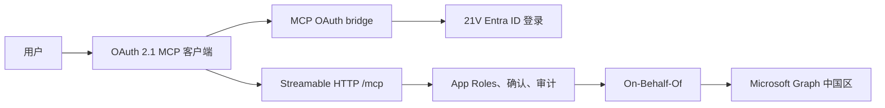

# MS 365-21V MCP Server Pro

面向 Microsoft 365 operated by 21Vianet（世纪互联）的远程 MCP 服务。它通过标准 Streamable HTTP 和 OAuth 2.1，让支持 MCP 的 AI 客户端以当前登录用户的身份访问 Microsoft Graph 中国区。

项目目前实现 150 个工具，覆盖邮件、日历、OneDrive、SharePoint、Teams、联系人、组织用户、Microsoft Search 和智能聚合。所有业务调用都使用 Delegated permissions，不使用后台应用身份冒充用户。

> 本项目不是 Microsoft 或 21Vianet 官方产品。生产使用前，请由租户管理员和安全团队审核 Entra 权限、Conditional Access、用户分配和数据合规要求。

## 为什么使用它

- **为 21V 环境设计**：使用中国区 Entra、Microsoft Graph endpoint 和 delegated permission。
- **通用 OAuth 2.1 接入**：内置 OAuth bridge，客户端只需连接一个 HTTPS MCP 地址，不必原生适配 21V 的 OAuth 差异。
- **按用户授权**：可以用 Entra App Roles 控制每个用户可见和可调用的工具模块，工具列表与实际执行使用同一套校验。
- **中文请求快路径**：常用工具可直接暴露；长尾工具可按中文意图动态搜索，兼顾调用速度和上下文大小。
- **可审计的写操作**：邮件、Teams 消息和高风险写操作支持确认策略、一次性批准和脱敏审计。
- **开箱即用的智能聚合**：提供邮件摘要和日程冲突分析，减少 Agent 自己组合多次 Graph 请求的成本。

## 能力范围

| 模块 | 示例能力 |
|---|---|
| 邮件 | 查询、搜索、附件、草稿、发送、回复、转发、移动和删除 |
| 日历 | 日程查询、忙闲分析、重复日程、创建、更新和取消 |
| OneDrive | 浏览、搜索、上传、下载、移动、分享、权限和版本 |
| SharePoint | 站点、列表、列表项、文档库、分享和版本 |
| Teams | 团队、频道、聊天和消息，实际范围取决于租户权限 |
| 联系人与用户 | 联系人管理、当前用户和组织用户基础资料 |
| Microsoft Search | 跨邮件、日历、文件、SharePoint 和 Teams 搜索 |
| 智能聚合 | 邮件摘要、日程冲突分析 |

完整工具、App Role 和 Graph scope 映射见 [工具目录](docs/TOOL_CATALOG.md)。21V 对部分全球云 API 不提供支持，本项目不会把这些 API 标记为可用。

## 工作方式



客户端拿到的是本服务签发的短期 bridge token。服务端再把已登录用户的 Microsoft token 通过 On-Behalf-Of 换成 Graph token，因此 Graph 最终看到的仍是当前用户，用户本身没有权限的数据不会因为 MCP 而变得可访问。

## 快速开始

下面使用推荐的**双应用 + Web 登录**模式。单应用和 public/native client 模式也受支持，见 [Entra 登录模式说明](docs/ENTRA_CONFIDENTIAL_WEB_LOGIN.md)。

### 准备条件

- 一个 Microsoft 365 operated by 21Vianet 租户。
- 可以创建 App Registration、添加 delegated permissions 并执行 admin consent 的管理员。
- Docker，或者 Node.js 22+ 与 npm。
- 远程部署时需要一个能够转发到本服务 3000 端口的 HTTPS 地址。

示例使用：

```text
MCP 地址: https://mcp.example.cn/mcp
Entra 回调: https://mcp.example.cn/oauth/microsoft/callback
```

本机测试可把域名替换为 `http://localhost:3000`，并在 Entra 中配置完全相同的本机回调。

### 1. 配置 Entra ID

打开 [Azure 中国门户](https://portal.azure.cn)，进入 **Microsoft Entra ID > 应用注册**。

#### 应用一：MCP API

1. 新建单租户应用，例如 `MS365-21V-MCP-API`，记录 **Tenant ID** 和 **Application (client) ID**。
2. 打开 **证书和密码**，创建一个 client secret。它只保存在 MCP 服务器，用于 OBO。
3. 打开 **公开 API**，将 Application ID URI 设置为：

   ```text
   api://<API_CLIENT_ID>
   ```

4. 添加 delegated scope：

   ```text
   access_as_user
   ```

   建议选择 **仅管理员可同意**。
5. 打开 **API 权限 > 添加权限 > Microsoft Graph > 委托的权限**，先添加 `User.Read`。
6. 点击 **代表组织授予管理员同意**。

#### 应用二：Web 登录客户端

1. 新建单租户应用，例如 `MS365-21V-MCP-Web`。
2. 打开 **身份验证 > 添加平台 > Web**，填写精确回调地址：

   ```text
   https://mcp.example.cn/oauth/microsoft/callback
   ```

3. 不要启用 implicit grant，也不要启用 public client flow。
4. 打开 **证书和密码**，创建这个 Web 应用自己的 client secret。
5. 打开 **API 权限 > 添加权限 > 我的 API**，选择前面的 MCP API 应用，再选择 delegated permission `access_as_user`。
6. 点击 **代表组织授予管理员同意**。

如果“我的 API”里看不到 MCP API，请先给两个 App Registration 添加同一个 Owner，再刷新页面。

#### 按功能增加 Graph 权限

只在 **MCP API 应用**上添加 Microsoft Graph delegated permissions。先从需要的模块开始，不必一次开放全部权限。

| 功能 | 常用 delegated permissions |
|---|---|
| 当前用户 | `User.Read` |
| 邮件读取/发送 | `Mail.Read`、`Mail.ReadWrite`、`Mail.Send` |
| 日历 | `Calendars.Read`、`Calendars.ReadWrite` |
| OneDrive | `Files.Read`、`Files.ReadWrite` |
| SharePoint | `Sites.Read.All`、`Sites.ReadWrite.All`、`Files.Read.All`、`Files.ReadWrite.All` |
| Teams 聊天 | `Chat.Read`、`Chat.ReadWrite`、`Chat.Create`、`ChatMessage.Send` |
| 联系人 | `Contacts.Read`、`Contacts.ReadWrite` |
| 组织用户基础资料 | `User.ReadBasic.All` |

每次增加权限后都要重新执行 admin consent。组织范围较大的 Teams、Group、User 和站点权限应先经过安全审批；未获批的 scope 可以保留在 `MCP_DISABLED_GRAPH_SCOPES`，相关工具会同时从工具列表和执行入口隐藏。

### 2. 获取代码并填写配置

```bash
git clone https://github.com/mdwsk88/ms-365-21v-mcp-server-pro.git
cd ms-365-21v-mcp-server-pro
cp .env.example .env
```

编辑 `.env`，双应用 Web 模式最少需要填写：

```dotenv
# 21V tenant 与 MCP API 应用
MS_TENANT_ID=<TENANT_ID>
MS_CLIENT_ID=<API_CLIENT_ID>
MS_CLIENT_SECRET=<API_CLIENT_SECRET>

# Web 登录应用
MS_OAUTH_CLIENT_ID=<WEB_CLIENT_ID>
MS_OAUTH_CLIENT_SECRET=<WEB_CLIENT_SECRET>

# 21V endpoints
MS_AUTHORITY_HOST=https://login.partner.microsoftonline.cn
MS_GRAPH_BASE_URL=https://microsoftgraph.chinacloudapi.cn/v1.0

# 服务公开地址，不包含 /mcp
MCP_PUBLIC_BASE_URL=https://mcp.example.cn
MCP_HTTP_HOST=0.0.0.0
MCP_HTTP_PORT=3000
MCP_HTTP_PATH=/mcp

# MCP API scope
MCP_AUTHORIZATION_SCOPES=api://<API_CLIENT_ID>/access_as_user
MCP_TOKEN_AUDIENCE=api://<API_CLIENT_ID>
MCP_REQUIRED_TOKEN_SCOPES=access_as_user

# OAuth bridge
MCP_OAUTH_BRIDGE_ENABLED=true
MCP_OAUTH_BRIDGE_MICROSOFT_CLIENT_TYPE=confidential_web

# 第一次联调可暂时关闭；生产建议启用并分配 App Roles
MCP_ROLE_BASED_FILTERING=false

# 推荐的工具与写操作策略
MCP_TOOL_EXPOSURE_MODE=hybrid
MCP_SEND_MODE=confirm
MCP_AUDIT_LOG_ENABLED=true
MCP_ADMIN_TOKEN=<LONG_RANDOM_VALUE>
```

`MCP_PUBLIC_BASE_URL` 会自动生成 MCP resource metadata、OAuth issuer 和 Microsoft callback。只有平台在公网 URL 前增加了路径前缀时，才需要填写带完整前缀的地址。

Microsoft 官方列出的中国云 Entra 根地址是 `https://login.chinacloudapi.cn`。部分 21V 租户实际使用 `https://login.partner.microsoftonline.cn`；请以租户现有应用和登录日志中的 authority 为准，并通过 `MS_AUTHORITY_HOST` 显式配置。

不要提交 `.env`。`.gitignore`、Docker 构建和公开发布检查都会排除真实凭据，但 secret 仍应存放在部署平台的 Secret Manager 中。

### 3A. 使用 Docker 启动

```bash
docker compose up -d --build
docker compose ps
curl http://127.0.0.1:3000/healthz
```

Docker 使用非 root 用户运行，并把 token 状态和审计日志保存在项目的 `.tokens` 目录。修改 `.env` 后重新执行：

```bash
docker compose up -d --build
```

### 3B. 使用源码启动

```bash
npm ci
npm run build
npm run start:http
```

开发模式：

```bash
npm run dev:http
```

### 4. 配置 MCP 客户端

在支持 OAuth 2.1 和 Streamable HTTP 的客户端中添加：

```json
{
  "mcpServers": {
    "ms365-21v": {
      "type": "streamable-http",
      "url": "https://mcp.example.cn/mcp"
    }
  }
}
```

有些客户端把 `type` 写成 `http`，图形界面通常只需要填写 endpoint URL。首次连接时，客户端应读取 OAuth metadata 并打开 21V Entra 登录页。

### 5. 验证

1. 检查服务：

   ```bash
   curl https://mcp.example.cn/healthz
   ```

2. 在 MCP 客户端中确认能看到 `auth_status` 和业务工具。
3. 先调用“查看我的认证状态”或“获取我的个人资料”。
4. 再测试一个低风险读操作，例如“列出最近 5 封邮件”或“查看今天的日程”。

如果能看到工具但不弹登录页，优先检查 `/mcp` 未携带 Bearer token 时是否返回 `401` 和正确的 `resource_metadata`。常见回调、路径前缀和设备策略问题见 [登录模式与排障](docs/ENTRA_CONFIDENTIAL_WEB_LOGIN.md)。

## 用户权限

第一次联调可以使用 `MCP_ROLE_BASED_FILTERING=false`。正式共享给多人前，建议启用按用户授权：

1. 在 MCP API App Registration 的 Manifest 中加入 [预置 App Roles](docs/entra-app-roles.json)。
2. 打开 **Entra ID > 企业应用程序 > MCP API 应用 > 用户和组**。
3. 添加用户或组，并分配 `mcp.mail`、`mcp.calendar`、`mcp.drive` 等角色。
4. 需要智能邮件摘要时分配 `mcp.smart` + `mcp.mail`；需要日程冲突分析时分配 `mcp.smart` + `mcp.calendar`。
5. 把 `MCP_ROLE_BASED_FILTERING` 改为 `true` 并重启服务。
6. 如需阻止未分配用户登录，在 Enterprise Application 的属性中把 **Assignment required?** 设置为 **Yes**。

`mcp.admin` 允许访问当前部署已加载且 Graph scope 已批准的全部工具，但它不能绕过 Graph delegated permission，也不能绕过用户原本对邮箱、站点、文件或团队的数据权限。

## 工具暴露模式

| 模式 | 客户端看到的工具 | 适用场景 |
|---|---|---|
| `direct` | 当前用户获准的全部工具 | 工具数量可控、追求最低调用延迟 |
| `discovery` | 基础工具和动态发现工具 | 希望显著减少初始 Schema |
| `hybrid` | 常用工具直达，长尾工具动态发现 | 推荐，兼顾中文命中速度和上下文大小 |

`hybrid` 模式下，动态调用仍会重新进入统一权限、确认和审计链路，不能绕过安全策略。配置与基准见 [工具暴露基准](docs/TOOL_EXPOSURE_BENCHMARK.md)。

## 写操作确认

- `MCP_SEND_MODE=confirm`：邮件和 Teams 消息需要用户确认，适合交互式客户端。
- `MCP_SEND_MODE=automatic`：允许自动发送，适合经过审批的无人值守流程。
- `MCP_CONFIRM_OPERATIONS`：配置删除文件、创建日程、创建分享链接等其他需要确认的操作。

客户端支持 MCP elicitation 时，确认在客户端内完成；不支持时，服务返回一次性 HTTPS 预览页。`automatic` 只跳过发送确认，不会跳过 OAuth、App Roles、Graph 权限或审计。

## 生产检查

- 只通过 HTTPS 暴露远程 MCP 和 OAuth callback。
- 使用 Secret Manager 保存 client secret 和 `MCP_ADMIN_TOKEN`，不要提交 `.env`。
- 启用 `MCP_ROLE_BASED_FILTERING=true`，并按最小权限给用户或组分配 App Roles。
- 只移除已经在 Entra 中获批并完成 consent 的 `MCP_DISABLED_GRAPH_SCOPES`。
- 保持 `MCP_AUDIT_LOG_ENABLED=true`，并把日志接入组织规定的留存和 SIEM 流程。
- 根据场景选择 `MCP_SEND_MODE` 和 `MCP_CONFIRM_OPERATIONS`。
- 对公网部署增加反向代理、访问日志、限流、健康检查和凭据轮换。

更完整的安全边界见 [威胁模型](docs/THREAT_MODEL.md) 和 [安全策略](SECURITY.md)。

## 开发与测试

```bash
npm ci
npm test
npm run docs:tools
npm run benchmark:tools
npm run check:release
```

- `npm test`：构建并运行完整测试。
- `npm run docs:tools`：从运行时注册表重新生成工具目录。
- `npm run benchmark:tools`：比较 direct、discovery 和 hybrid 的 Schema 大小。
- `npm run check:release`：检查凭据、私有部署材料和开源发布必需文件。

## 文档

- [用户使用说明](USER_GUIDE.md)
- [完整工具目录](docs/TOOL_CATALOG.md)
- [Entra 登录模式、单/双应用与个人设备测试](docs/ENTRA_CONFIDENTIAL_WEB_LOGIN.md)
- [工具暴露模式基准](docs/TOOL_EXPOSURE_BENCHMARK.md)
- [威胁模型](docs/THREAT_MODEL.md)
- [私有部署 overlay 说明](deploy/overlays/README.md)

## 贡献与安全

提交代码前请阅读 [CONTRIBUTING.md](CONTRIBUTING.md)。安全问题不要创建公开 Issue，请按 [SECURITY.md](SECURITY.md) 中的方式报告。

## License

本项目基于 [Apache License 2.0](LICENSE) 开源。

Microsoft、Microsoft 365、Microsoft Entra、Microsoft Graph 和相关名称是其各自所有者的商标。项目命名和使用边界见 [TRADEMARKS.md](TRADEMARKS.md)。
